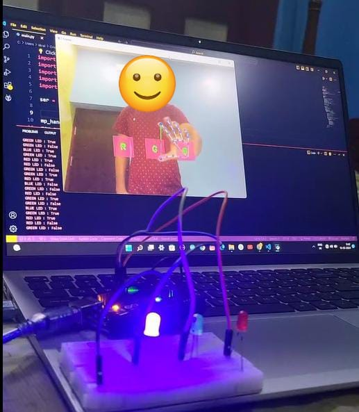

# Gesture Virtual Button LED Control

## Overview

The **Gesture Virtual Button LED Control** project enables control of LED lights using hand gestures detected through a webcam. By using the MediaPipe library for gesture recognition and an Arduino board for LED control, users can interact with virtual buttons displayed on the screen to toggle LED lights.



## Features

- **Gesture Recognition**: Utilizes MediaPipe to detect hand gestures.
- **Virtual Buttons**: Displays virtual buttons on the screen that can be controlled using hand gestures.
- **LED Control**: Communicates with an Arduino board to control LEDs based on detected gestures.
- **Real-Time Interaction**: Provides immediate feedback by toggling LEDs when gestures are detected.

## Components

- **Python**: For gesture recognition and interface with the Arduino.
- **MediaPipe**: For hand gesture detection.
- **OpenCV**: For capturing video and rendering virtual buttons.
- **Arduino**: For controlling the LEDs.
- **Serial Communication**: For sending commands from the Python script to the Arduino.

## Installation

### Python Requirements

1. Install Python 3.x if not already installed.
2. Install required libraries using pip:

   ```bash
   pip install opencv-python mediapipe pyserial
   ```

## Arduino Setup

1. **Connect the LEDs**: Connect the LEDs to the Arduino according to the pin configuration in `main.ino`.
2. **Upload the Sketch**: Upload the `main.ino` sketch to the Arduino using the Arduino IDE.

## Usage

1. **Connect Hardware**: Ensure the Arduino is connected to your computer via USB and the LEDs are properly wired.

2. **Run the Python Script**: Execute `main.py` to start the gesture recognition system.

   ```bash
   python main.py
   ```
3. **Interact with Virtual Buttons: Use hand gestures to interact with the virtual buttons displayed on the screen. The corresponding LEDs will toggle based on the detected gestures.**
